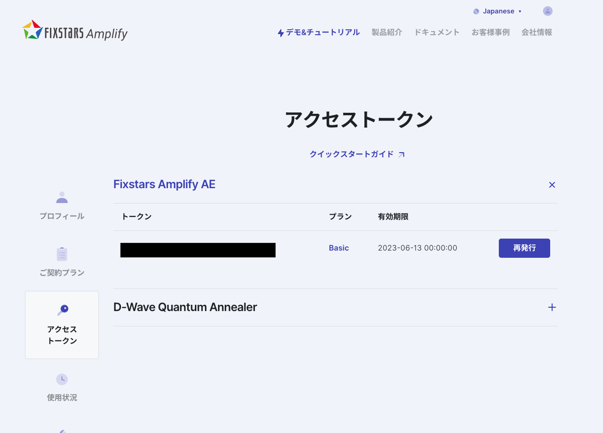

# Menu-recommend

## Overview

2023年度の未踏ターゲット事業[^1]で作成したアプリです。アニーリングマシン、もしくはSAを使用して、ユーザの条件に適したレシピの組み合わせ、1食分の献立を推薦します。

## Usage
(2023.3　現在)

https://mitou-tg-recipe.github.io/menu-recommend/

上記のURLからアプリにアクセスします。様々な条件を入力し、ページ下部にある「献立を作成」ボタンを押します。レシピ大百科[^2]に掲載されているレシピを組み合わせて、複数の献立を推薦します。

## Features

### 入力ページ
#### マシン
(必須)

組合せ最適化問題を解く際に使用するマシンを「Simulated Annealing」か「Fixstars Amplify AE」のどちらかを選択してください。「Fixstars Amplify AE」をマシンとして選択した場合、トークンの入力が必要になります。

##### トークン取得方法

1. fixstarsのamplify[^3]のアカウント登録をします。

2. 右上の「プロフィール」をクリックする。

3. プロフィールページの左のタブの「アクセストークン」をクリックする。

4. アクセストークンを取得する。

#### 主食
(必須)

主食がご飯の場合「ご飯」を、それ以外、もしくは、指定がない場合「指定なし」を選択してください。

#### ジャンル
(必須)

献立のジャンルを、「全て」「和風」「洋風」「中華風」「韓国風」の中から選択してください(複数可)。
「和風」「洋風」を含むと献立作成に時間がかかってしまうので気をつけてください。

#### 人数
(必須)

推薦する献立の人数を入力してください。

#### メニュー数
(必須)

1食分のメニュー数を「指定なし」か「入力」を選択してください。「入力」を選択した場合、メニュー数を1~5の範囲で入力してください。

#### 栄養素と調理時間
(必須)

「塩分」「たんぱく質」「野菜摂取量」「調理時間」の値を数値で入力、そしてその値の重みをスライダーで設定してください。重みは0~0.5の範囲で設定できます。重みが0の時は対応する制約は考慮されません。デフォルト値として、「塩分」は3g、「たんぱく質」は30g、「野菜摂取量」は100g、「調理時間」は60分、すべての重みは0.1となっています。

#### 好き嫌い
(任意)

食材名で検索をすると、サジェストされた食材名をクリックすると検索窓の下に食材名のボタン群が出現します。好きな食材として登録したい場合、ハートマークのLikeボタンをクリック、嫌いな食材として登録したい場合、サムズダウンマークのDislikeボタンをクリックします。その食材を使用しない場合、ゴミ箱マークのDeleteボタンをクリックして食材名のボタン群を消すことができます。

#### 使用食材
(任意)

1. 1番左のタブの「使用食材」の使用したい食材名を検索します。もしくは、使用したい食材が属するタブをクリックし、使用したい食材にクリックをします。

2. 量を考慮しない場合は「買う」を選択し、g数を考慮したい場合は「g入力」を選択しgを入力します。さらに、使い切りたい場合は、「使い切り」にチェックをいれます。

3. 最終的に使用したい食材群は1番左のタブの「使用食材」に表示されている食材を使用したい食材として設定します。

### 結果ページ

入力条件によっては献立が表示されない可能性があります。表示されない場合は、入力条件を変更してみてください。

#### 制約満たしている献立

ユーザの入力条件を全て満たしている献立を表示します。
献立を構成するレシピ名と一食分の献立の栄養素と時間を表示します。

#### 制約満たしてない献立

ユーザの入力条件を破っている献立を表示します。
条件を満たしていない項目と、献立を構成するレシピ名と一食分の献立の栄養素と時間を表示します。

[^1]: https://www.ipa.go.jp/jinzai/target/2022/gaiyou_tr-1.html

[^2]: https://park.ajinomoto.co.jp/recipe/

[^3]: https://amplify.fixstars.com/ja/register